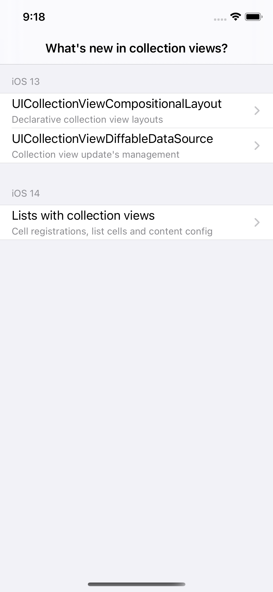
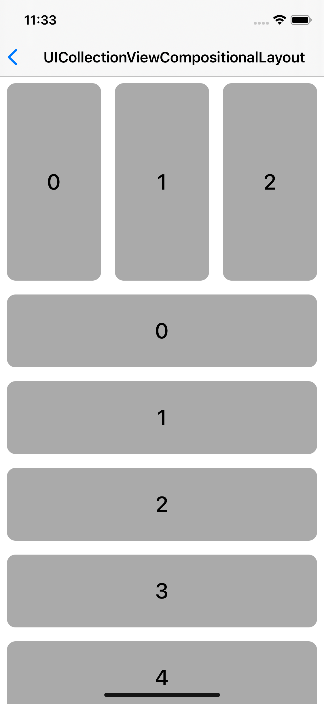
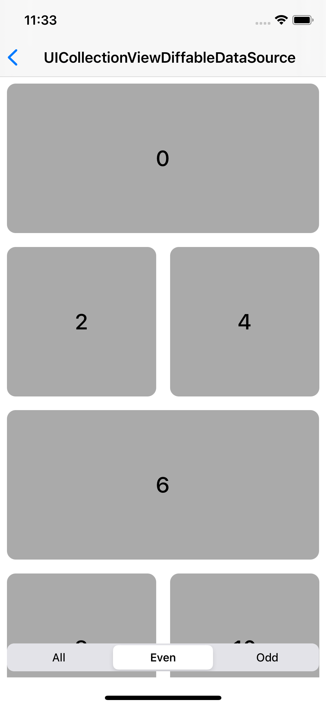
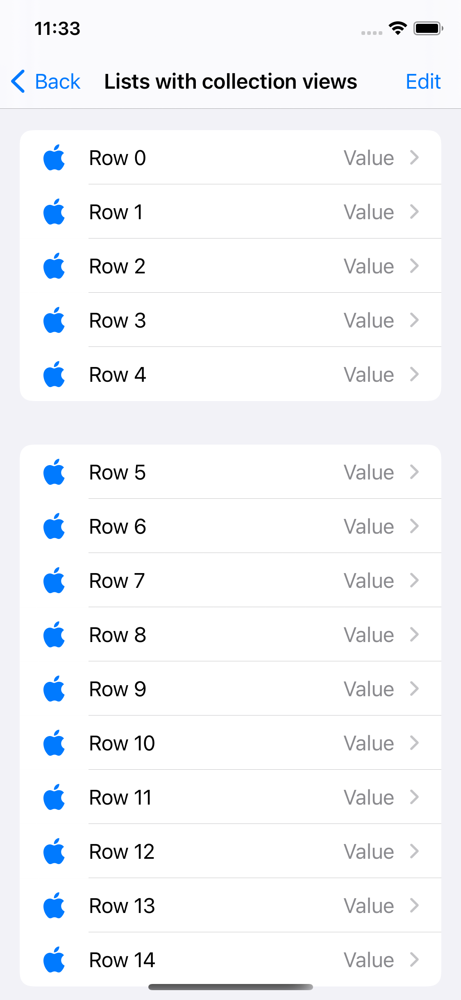

# ModernCollectionViews

Sample project that demonstrates what's new in collection views for iOS 13/14.

## Requirements

- iOS 14.0+
- Xcode 12+

## Screenshots

 
 

## Contributing

Feel free to open an issue or submit a pull request if you have any improvement or feedback.

## Author

Alonso Alvarez, alonso.alvarez.dev@gmail.com
